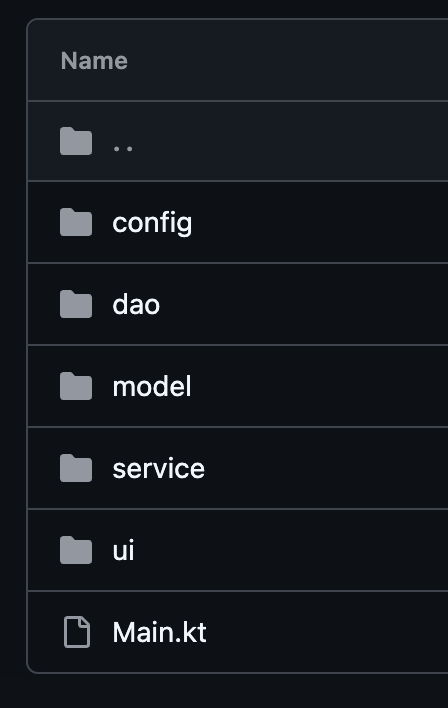

# Solución del proyecto

- **Proyecto:** <!-- Nombre del proyecto -->
- **Alumno/a:**  Aarón Gallardo Canto
- **Repositorio:** https://github.com/IES-Rafael-Alberti/2526-u8u9-9-1-proyectolibre-aaron050223

## 1. Resumen del proyecto

- **Problema que resuelve:** Programa para gestionar la reserva y reseñas de las pistas deportivdas de un pabellón.
- **Usuarios principales:** Público general que busca reservar una pista para jugar a cualquiera de los deportes disponibles y, si lo deseara, realizar alguna reseña para favorecer a la mejora de las instalaciones.
- **Funcionalidades principales:**
  - Realizar / eliminar / ver reservas.
  - Realizar / eliminar / ver reseñas.
- **Entidades principales:** 
  - Reserva: una reserva de pista para una fecha, turno y usuario.
  - Pista: catálogo/diccionario de pistas (id + deporte) usado por las reservas.
  - Reseña (Resena): valoración (nota + descripción) asociada a una reserva pasada. 
- **Estructura del proyecto:**
  - raíz: punto de entrada de la aplicación (Main.kt), configura logs, inicializa MongoDB/H2 y lanza el menú.
  - ui: interfaz de usuario por consola (MenuTerminal), menús y validación de entrada.
  - service: lógica de negocio (PabellonService), reglas y coordinación entre persistencias.
  - model: entidades del dominio (Reserva, Pista, Resena).
  - dao: interfaces DAO (contratos) para acceso a datos (ReservaDAO, PistaDAO, ResenaDAO).
  - dao.bdd: implementación SQL/H2 de DAOs (ReservaDAOH2, PistaDAOH2).
  - dao.mongo: implementación MongoDB Atlas (ResenaDAOMongo).
  - dao.memory: implementación en memoria para pruebas (ReservaDAOMemory).
  - config: configuración e inicialización de la base de datos H2 (DatabaseManager).

## 2. Instalación y ejecución

- **Requisitos previos:**
  - JDK 21.
  - Conexión a Internet para acceder a MongoDB Atlas.
  - Un clúster de MongoDB Atlas.
- **Configuración necesaria:**
  - Configurar la URI de MongoDB Atlas en src/main/kotlin/Main.kt (variable mongoUri).
  - La BD relacional es H2 en fichero local (jdbc:h2:./db/pabellon): se crea automáticamente al ejecutar.
  - La app crea/usa:
    - Carpeta db/ para H2.
    - Carpeta logs/ y fichero logs/mongo.log para logs de Mongo.
    - En Atlas: BD pabellon y colección resenas.
- **Datos de prueba incluidos:**
  - En H2 se cargan automáticamente las pistas iniciales (pistas: 1 Fútbol, 2 Baloncesto, 3 Pádel, 4 Fútbol Sala).

## 3. Diseño y modelo

- **Clases principales:**
  - MenuTerminal (src/main/kotlin/ui/MenuTerminal.kt) -> Interfaz por consola: menús, entradas y mostrar listados.
  - PabellonService (src/main/kotlin/service/PabellonService.kt) -> Lógica de negocio: valida reglas (no duplicar turnos, reseñas solo de reservas pasadas, rangos de nota/descripcion).
  - DatabaseManager (src/main/kotlin/config/DatabaseManager.kt) -> Configura y crea las tablas en H2.
  - ReservaDAOH2 / PistaDAOH2 (src/main/kotlin/dao/bdd/*) -> Acceso H2 para reservas y pistas.
  - ResenaDAOMongo (src/main/kotlin/dao/mongo/ResenaDAOMongo.kt) -> Acceso a MongoDB Atlas para reseñas.
  - Modelos: Reserva, Pista, Resena (src/main/kotlin/model/*).
- **Relaciones importantes:**
  - Interfaces + polimorfismo (DAO):
    - ReservaDAO, PistaDAO, ResenaDAO (interfaces) con implementaciones concretas en dao/bdd, dao/mongo, dao/memory.
  - Composición / inyección de dependencias:
    - MenuTerminal contiene un PabellonService.
    - PabellonService contiene ReservaDAO, PistaDAO, ResenaDAO.
- **Colecciones usadas:**
  - List:
    - Para listados de reservas/pistas/reseñas (DAOs devuelven listas).
  - Map:
    - MenuTerminal: horariosTurnos: Map<Int, String> para mostrar los turnos.
    - PabellonService.obtenerMapaPistas(): Map<Int, String> para traducir idPista -> deporte desde la tabla pistas.
  - Set:
    - En PabellonService.obtenerReservasPasadasSinResena(): Set<Int> con reservaId ya reseñadas para filtrar.
- **Principios SOLID aplicados:**
  - SRP (Single Responsibility Principle):
    - MenuTerminal solo gestiona UI/entrada-salida.
    - PabellonService concentra reglas de negocio.
    - DAOs se encargan solo de persistencia.
  - DIP (Dependency Inversion Principle):
    - PabellonService depende de interfaces (ReservaDAO, PistaDAO, ResenaDAO) y no de implementaciones concretas; permite cambiar H2/Mongo/memoria sin reescribir la lógica.
- **Patrones de diseño:**
  - DAO (Data Access Object):
    - ReservaDAO/PistaDAO/ResenaDAO separan el acceso a datos de la lógica de negocio.
  - Arquitectura por capas (UI -> Service -> DAO/Model):

## 4. Persistencia

### Ficheros

- **Ficheros usados:**
  - logs/mongo.log (ruta: ./logs/mongo.log)
- **Formato y contenido:**
  - Texto plano (.log), líneas de log generadas por el driver de MongoDB.
- **Lectura/escritura:**
  - Escritura: se vuelcan los logs del driver a ese fichero para evitar que salgan por terminal.
  - Lectura: se obtiene la URI de MongoDB para no tenerla en el Main.
- **Clase responsable:**
  - Main.kt (src/main/kotlin/Main.kt), crea la carpeta logs/ con File("logs").mkdirs()
  - https://github.com/IES-Rafael-Alberti/2526-u8u9-9-1-proyectolibre-aaron050223/blob/3530076bb32a32d640f8ddbbda48e1ae1186c1ae/src/main/kotlin/Main.kt#L15-L17
- **Errores controlados:**
  - Si no se puede crear la carpeta o escribir el fichero, el programa puede seguir funcionando.

### MongoDB

- **Base de datos:** pabellon
- **Colecciones:**
  - resenas: almacena las reseñas asociadas a reservas pasadas (1 reseña por reserva, asegurado con índice único en reservaId).
- **Documento de ejemplo:**

```json
{
  "_id": {
    "$oid": "6a1dad399afe196779e84196"
  },
  "reservaId": 3,
  "nota": 3.5,
  "descripcion": "Muy bien pero la pista tenia zonas donde el parqué no estaba del todo bien puesto.",
  "createdAt": {
    "$numberLong": "1780329785881"
  }
}
```

- **Operaciones realizadas:**
  - Insertar: crear reseña.
  - Consultar: listar reseñas / buscar por reservaId.
  - Borrar: eliminar reseña por reservaId.
- **Clase responsable:**
  - ResenaDAOMongo (src/main/kotlin/dao/mongo/ResenaDAOMongo.kt)
    https://github.com/IES-Rafael-Alberti/2526-u8u9-9-1-proyectolibre-aaron050223/blob/3530076bb32a32d640f8ddbbda48e1ae1186c1ae/src/main/kotlin/dao/mongo/ResenaDAOMongo.kt#L13-L61

### Base de datos relacional

- **SGBD utilizado:** H2
- **Tablas y relaciones:** 
  - pistas(id, deporte)
  - reservas(id, id_pista, fecha, turno, usuario)
  - Relación: reservas.id_pista referencia a pistas.id
- **Operaciones CRUD:**
  - Create
  - Read
  - Delete
- **Consultas parametrizadas:**
  - ReservaDAOH2.buscarPorPistaYFecha (WHERE id_pista = ? AND fecha = ?)
    https://github.com/IES-Rafael-Alberti/2526-u8u9-9-1-proyectolibre-aaron050223/blob/3530076bb32a32d640f8ddbbda48e1ae1186c1ae/src/main/kotlin/dao/bdd/ReservaDAOH2.kt#L31-L61
- **Gestión de conexión y cierre:**
  - En DatabaseManager se usa `use{}` para cerrar automáticamente.
    https://github.com/IES-Rafael-Alberti/2526-u8u9-9-1-proyectolibre-aaron050223/blob/3530076bb32a32d640f8ddbbda48e1ae1186c1ae/src/main/kotlin/config/DatabaseManager.kt#L51-L57

## 5. Validaciones y errores

- **Expresiones regulares:**
- Dato validado: nombre de usuario (usuario) al hacer una reserva.
  - Regex: ^[A-Za-zÁÉÍÓÚÜÑáéíóúüñ]+(?: [A-Za-zÁÉÍÓÚÜÑáéíóúüñ]+)*$.
  - Longitud: length in 2..30 (controlada aparte, fuera de la regex).
    https://github.com/IES-Rafael-Alberti/2526-u8u9-9-1-proyectolibre-aaron050223/blob/5251f6aa3a215c5ae5004ab662828965f9149424/src/main/kotlin/ui/MenuTerminal.kt#L26-L29
- **Excepciones controladas:**
  - DateTimeParseException -> se captura en MenuTerminal.preguntarFecha() y se muestra un mensaje al usuario, repitiendo el input.
  - SQLException en H2 (lecturas/escrituras/inicialización) -> se captura en DatabaseManager, ReservaDAOH2 y PistaDAOH.
  - MongoWriteException al insertar una reseña duplicada (índice único) -> se origina en ResenaDAOMongo.guardar y PabellonService.crearResena la captura con un catch devolviendo false.
  - https://github.com/IES-Rafael-Alberti/2526-u8u9-9-1-proyectolibre-aaron050223/blob/5251f6aa3a215c5ae5004ab662828965f9149424/src/main/kotlin/service/PabellonService.kt#L63-L79
- **Excepciones propias:**
  - No realiazadas aun.

## 6. Pruebas y evidencias

- **Pruebas realizadas:**
  - Pruebas automatizadas con Kotest sobre la lógica de negocio en PabellonServiceTest.
- **Datos de prueba:**
  - Reservas: creadas en las pruebas automatizadas con fechas fijas.
  - Reseñas: creadas con nota válida (por ejemplo, 4.5 o 4.0) y descripción corta ("Ok", "Bien", etc.).
- **Evidencia de ejecución:**
  - Menú principal y submenú de Reseñas (mensajes del MenuTerminal).
  - Salida por consola:
  ```
  --- SELECCIÓN ---
  1. Hacer reserva
  2. Eliminar reserva
  3. Ver reservas
  4. Reseñas
  5. Salir
  Elige una opción (1-5):
  ```
- **Evidencia de ficheros:**
  - logs/mongo.log: fichero generado automáticamente al arrancar la app, donde se vuelcan los logs del driver de MongoDB
  ```
  [main] INFO org.mongodb.driver.client - MongoClient with metadata {"application": {"name": "basedatosaaron"}, "driver": {"name": "mongo-java-driver|sync", "version": "5.2.0"}, "os": {"type": "Darwin", "name": "Mac OS X", "architecture": "aarch64", "version": "26.2"}, "platform": "Java/Microsoft/21.0.11+10-LTS"} created with settings MongoClientSettings{readPreference=primary, writeConcern=WriteConcern{w=null, wTimeout=null ms, journal=null}, retryWrites=true, retryReads=true, readConcern=ReadConcern{level=null}, credential=MongoCredential{mechanism=null, userName='userAlberti', source='admin', password=<hidden>, mechanismProperties=<hidden>}, transportSettings=null, commandListeners=[], codecRegistry=ProvidersCodecRegistry{codecProviders=[ValueCodecProvider{}, BsonValueCodecProvider{}, DBRefCodecProvider{}, DBObjectCodecProvider{}, DocumentCodecProvider{}, CollectionCodecProvider{}, IterableCodecProvider{}, MapCodecProvider{}, GeoJsonCodecProvider{}, GridFSFileCodecProvider{}, Jsr310CodecProvider{}, JsonObjectCodecProvider{}, BsonCodecProvider{}, EnumCodecProvider{}, com.mongodb.client.model.mql.ExpressionCodecProvider@59717824, com.mongodb.Jep395RecordCodecProvider@146044d7, com.mongodb.KotlinCodecProvider@1e9e725a]}, loggerSettings=LoggerSettings{maxDocumentLength=1000}, clusterSettings={hosts=[127.0.0.1:27017], srvHost=basedatosaaron.evvnhth.mongodb.net, srvServiceName=mongodb, mode=MULTIPLE, requiredClusterType=REPLICA_SET, requiredReplicaSetName='atlas-7cozd2-shard-0', serverSelector='null', clusterListeners='[]', serverSelectionTimeout='30000 ms', localThreshold='15 ms'}, socketSettings=SocketSettings{connectTimeoutMS=10000, readTimeoutMS=0, receiveBufferSize=0, proxySettings=ProxySettings{host=null, port=null, username=null, password=null}}, heartbeatSocketSettings=SocketSettings{connectTimeoutMS=10000, readTimeoutMS=10000, receiveBufferSize=0, proxySettings=ProxySettings{host=null, port=null, username=null, password=null}}, connectionPoolSettings=ConnectionPoolSettings{maxSize=100, minSize=0, maxWaitTimeMS=120000, maxConnectionLifeTimeMS=0, maxConnectionIdleTimeMS=0, maintenanceInitialDelayMS=0, maintenanceFrequencyMS=60000, connectionPoolListeners=[], maxConnecting=2}, serverSettings=ServerSettings{heartbeatFrequencyMS=10000, minHeartbeatFrequencyMS=500, serverMonitoringMode=AUTO, serverListeners='[]', serverMonitorListeners='[]'}, sslSettings=SslSettings{enabled=true, invalidHostNameAllowed=false, context=null}, applicationName='basedatosaaron', compressorList=[], uuidRepresentation=UNSPECIFIED, serverApi=null, autoEncryptionSettings=null, dnsClient=null, inetAddressResolver=null, contextProvider=null, timeoutMS=null}
  [cluster-ClusterId{value='6a1ef1094e5a0b197299d106', description='basedatosaaron'}-srv-basedatosaaron.evvnhth.mongodb.net] INFO org.mongodb.driver.cluster - Adding discovered server ac-yinol0j-shard-00-02.evvnhth.mongodb.net:27017 to client view of cluster
  [cluster-ClusterId{value='6a1ef1094e5a0b197299d106', description='basedatosaaron'}-srv-basedatosaaron.evvnhth.mongodb.net] INFO org.mongodb.driver.cluster - Adding discovered server ac-yinol0j-shard-00-01.evvnhth.mongodb.net:27017 to client view of cluster
  [cluster-ClusterId{value='6a1ef1094e5a0b197299d106', description='basedatosaaron'}-srv-basedatosaaron.evvnhth.mongodb.net] INFO org.mongodb.driver.cluster - Adding discovered server ac-yinol0j-shard-00-00.evvnhth.mongodb.net:27017 to client view of cluster
  [cluster-ClusterId{value='6a1ef1094e5a0b197299d106', description='basedatosaaron'}-ac-yinol0j-shard-00-00.evvnhth.mongodb.net:27017] INFO org.mongodb.driver.cluster - Monitor thread successfully connected to server with description ServerDescription{address=ac-yinol0j-shard-00-00.evvnhth.mongodb.net:27017, type=REPLICA_SET_SECONDARY, cryptd=false, state=CONNECTED, ok=true, minWireVersion=0, maxWireVersion=25, maxDocumentSize=16777216, logicalSessionTimeoutMinutes=30, roundTripTimeNanos=317351250, minRoundTripTimeNanos=0, setName='atlas-7cozd2-shard-0', canonicalAddress=ac-yinol0j-shard-00-00.evvnhth.mongodb.net:27017, hosts=[ac-yinol0j-shard-00-00.evvnhth.mongodb.net:27017, ac-yinol0j-shard-00-01.evvnhth.mongodb.net:27017, ac-yinol0j-shard-00-02.evvnhth.mongodb.net:27017], passives=[], arbiters=[], primary='ac-yinol0j-shard-00-01.evvnhth.mongodb.net:27017', tagSet=TagSet{[Tag{name='availabilityZone', value='euw3-az1'}, Tag{name='cacheState', value='READY'}, Tag{name='diskState', value='READY'}, Tag{name='nodeType', value='ELECTABLE'}, Tag{name='provider', value='AWS'}, Tag{name='region', value='EU_WEST_3'}, Tag{name='workloadType', value='OPERATIONAL'}]}, electionId=null, setVersion=42, topologyVersion=TopologyVersion{processId=6a11df424ea36f3a2a3eb082, counter=4}, lastWriteDate=Tue Jun 02 17:04:41 CEST 2026, lastUpdateTimeNanos=244415803478750}
  [cluster-ClusterId{value='6a1ef1094e5a0b197299d106', description='basedatosaaron'}-ac-yinol0j-shard-00-01.evvnhth.mongodb.net:27017] INFO org.mongodb.driver.cluster - Monitor thread successfully connected to server with description ServerDescription{address=ac-yinol0j-shard-00-01.evvnhth.mongodb.net:27017, type=REPLICA_SET_PRIMARY, cryptd=false, state=CONNECTED, ok=true, minWireVersion=0, maxWireVersion=25, maxDocumentSize=16777216, logicalSessionTimeoutMinutes=30, roundTripTimeNanos=317179542, minRoundTripTimeNanos=0, setName='atlas-7cozd2-shard-0', canonicalAddress=ac-yinol0j-shard-00-01.evvnhth.mongodb.net:27017, hosts=[ac-yinol0j-shard-00-00.evvnhth.mongodb.net:27017, ac-yinol0j-shard-00-01.evvnhth.mongodb.net:27017, ac-yinol0j-shard-00-02.evvnhth.mongodb.net:27017], passives=[], arbiters=[], primary='ac-yinol0j-shard-00-01.evvnhth.mongodb.net:27017', tagSet=TagSet{[Tag{name='availabilityZone', value='euw3-az2'}, Tag{name='cacheState', value='READY'}, Tag{name='diskState', value='READY'}, Tag{name='nodeType', value='ELECTABLE'}, Tag{name='provider', value='AWS'}, Tag{name='region', value='EU_WEST_3'}, Tag{name='workloadType', value='OPERATIONAL'}]}, electionId=7fffffff0000000000000070, setVersion=42, topologyVersion=TopologyVersion{processId=6a11e12b9c8118123d37d1af, counter=6}, lastWriteDate=Tue Jun 02 17:04:41 CEST 2026, lastUpdateTimeNanos=244415803450875}
  [cluster-ClusterId{value='6a1ef1094e5a0b197299d106', description='basedatosaaron'}-ac-yinol0j-shard-00-02.evvnhth.mongodb.net:27017] INFO org.mongodb.driver.cluster - Monitor thread successfully connected to server with description ServerDescription{address=ac-yinol0j-shard-00-02.evvnhth.mongodb.net:27017, type=REPLICA_SET_SECONDARY, cryptd=false, state=CONNECTED, ok=true, minWireVersion=0, maxWireVersion=25, maxDocumentSize=16777216, logicalSessionTimeoutMinutes=30, roundTripTimeNanos=322389791, minRoundTripTimeNanos=0, setName='atlas-7cozd2-shard-0', canonicalAddress=ac-yinol0j-shard-00-02.evvnhth.mongodb.net:27017, hosts=[ac-yinol0j-shard-00-00.evvnhth.mongodb.net:27017, ac-yinol0j-shard-00-01.evvnhth.mongodb.net:27017, ac-yinol0j-shard-00-02.evvnhth.mongodb.net:27017], passives=[], arbiters=[], primary='ac-yinol0j-shard-00-01.evvnhth.mongodb.net:27017', tagSet=TagSet{[Tag{name='availabilityZone', value='euw3-az3'}, Tag{name='cacheState', value='READY'}, Tag{name='diskState', value='READY'}, Tag{name='nodeType', value='ELECTABLE'}, Tag{name='provider', value='AWS'}, Tag{name='region', value='EU_WEST_3'}, Tag{name='workloadType', value='OPERATIONAL'}]}, electionId=null, setVersion=42, topologyVersion=TopologyVersion{processId=6a11e2ac1245c66fa5f65289, counter=3}, lastWriteDate=Tue Jun 02 17:04:41 CEST 2026, lastUpdateTimeNanos=244415803439708}
  [cluster-ClusterId{value='6a1ef1094e5a0b197299d106', description='basedatosaaron'}-ac-yinol0j-shard-00-01.evvnhth.mongodb.net:27017] INFO org.mongodb.driver.cluster - Discovered replica set primary ac-yinol0j-shard-00-01.evvnhth.mongodb.net:27017 with max election id 7fffffff0000000000000070 and max set version 42
  ```
- **Evidencia de MongoDB:**
  - Inserción: al crear una reseña se ejecuta collection.insertOne en ResenaDAOMongo.guardar.
  - Consulta: collection.find() y find(eq("reservaId", ...)).
  - Borrado: collection.deleteOne(eq("reservaId", ...)).
  - Ejemplo de MongoDB Atlas:
  ```json
  {
  "_id": {
  "$oid": "6a1dad399afe196779e84196"
  },
  "reservaId": 3,
  "nota": 3.5,
  "descripcion": "Muy bien pero la pista tenia zonas donde el parqué no estaba del todo bien puesto.",
  "createdAt": {
  "$numberLong": "1780329785881"
  }
  }
  ```
- **Evidencia de SQL:**
  - Insert: INSERT INTO reservas (id_pista, fecha, turno, usuario) VALUES (?, ?, ?, ?) en ReservaDAOH2.guardar.
  - Select: SELECT * FROM reservas WHERE id_pista = ? AND fecha = ?, SELECT * FROM reservas WHERE id = ?, SELECT * FROM pistas ORDER BY id.
  - Delete: DELETE FROM reservas WHERE id = ?.

## 7. Refactorización, documentación y Git

- **Refactorizaciones aplicadas:**
  Validación del nombre de usuario con expresión regular
  - Qué se mejoró: el método preguntarNombre() de MenuTerminal solo comprobaba que el nombre no estuviera vacío, lo que era una validación muy débil (permitía "   ", números, símbolos, etc.).
  - Por qué: para cumplir con el requisito de “expresiones regulares” y para asegurar una entrada de datos coherente y presentable.
  - Cómo: se extrajo la validación a una función pública esNombreValido(nombre: String): Boolean en MenuTerminal que aplica la regex ^[A-Za-zÁÉÍÓÚÜÑáéíóúüñ]+(?: [A-Za-zÁÉÍÓÚÜÑáéíóúüñ]+)*$ junto con la restricción de longitud 2..30.
  - Beneficios:
  - Regla de validación centralizada y reutilizable.
  - Mensaje de error claro al usuario.
  - Posibilidad de testear la función directamente con Kotest (MenuTerminalRegexTest).
- **Código limpio:**
  - Nombres descriptivos en clases y métodos: PabellonService.hacerReserva, eliminarReservaFuturaPorId, obtenerReservasPasadasSinResena dejan claro qué hacen sin necesidad de leer la implementación.
  - Funciones con responsabilidad única: por ejemplo, MenuTerminal solo se encarga de UI (preguntas, impresión, menús), PabellonService solo reglas de negocio y DAOs solo acceso a datos.
  - Eliminación de duplicación al eliminar reservas pasadas:
    - eliminarReservaPorId en PabellonService reutiliza reservaDAO.obtenerPorId(id) para validar existencia, evitando recorrer la lista dos veces.
  - Ordenación coherente: obtenerReservasFuturas y obtenerReservasPasadas ordenan por fecha real, pista y turno (parseando el formato dd-MM-uuuu) en lugar de por orden textual, que no sería cronológico.
  - Validación aislada en esNombreValido: la regla del nombre está separada de la lectura por consola, evitando if anidados en el bucle de preguntarNombre().
- **Documentación:**
  - Se realiza documentación mediante KDoc:
  https://github.com/IES-Rafael-Alberti/2526-u8u9-9-1-proyectolibre-aaron050223/blob/e8cdfe5351eed1195aeb24babb89726e39ea7b83/src/main/kotlin/service/PabellonService.kt#L83-L92
  - Enlace al README donde se explica el codigo del programa: [README_CODIGO.md](README_CODIGO.md)
- **Control de versiones:**
  - He realizado varios commits a medida que iba avanzando el proyecto, pero siempre en la misma rama.

## 8. Problemas encontrados y soluciones

| Problema                 | Solución aplicada                    | Enlace o evidencia                                                                                                                                                                       |
|--------------------------|--------------------------------------|------------------------------------------------------------------------------------------------------------------------------------------------------------------------------------------|
| Tenía la URI hardcodeada | obtener la URI desde un fichero .txt | [Enlace](https://github.com/IES-Rafael-Alberti/2526-u8u9-9-1-proyectolibre-aaron050223/blob/1f0254c3aa9e104b8c9cceb59b30a3bbac85b20c/src/main/kotlin/config/DatabaseManager.kt#L88-L102) |

### 9.1. Diseño general

- **Temática:** programa para gestionar la reserva y reseñas de las pistas deportivdas de un pabellón.
- **Problema:** permitir a usuarios reservar pistas por fecha/turno y dejar reseña tras usarlas.
- **Entidades principales:** `Reserva`, `Pista`, `Resena` en `src/main/kotlin/model/`.
- **Funcionalidades principales:** 
  - Crear/eliminar/ver reservas.
  - Hacer/ver/eliminar reseñas.
- **Estructura del proyecto:** se organiza en capas por responsabilidad (UI, service, dao, model, config) para separar UI de lógica de negocio.
- **Justificación:** la separación por capas permite testear la lógica con DAOs en memoria y cambiar la persistencia sin tocar el resto.

### 9.2. Clases y objetos

- **Clases principales:**
  - `MenuTerminal` (interfaz por consola) en `src/main/kotlin/ui/MenuTerminal.kt`.
  https://github.com/IES-Rafael-Alberti/2526-u8u9-9-1-proyectolibre-aaron050223/blob/9c1e95e57860742ff3535adaa909149995e2b6cd/src/main/kotlin/ui/MenuTerminal.kt#L10-L487
  - `PabellonService` (lógica de negocio) en `src/main/kotlin/service/PabellonService.kt`.
  https://github.com/IES-Rafael-Alberti/2526-u8u9-9-1-proyectolibre-aaron050223/blob/9c1e95e57860742ff3535adaa909149995e2b6cd/src/main/kotlin/service/PabellonService.kt#L14-L175
  - `DatabaseManager` (configuración H2) en `src/main/kotlin/config/DatabaseManager.kt`.
  https://github.com/IES-Rafael-Alberti/2526-u8u9-9-1-proyectolibre-aaron050223/blob/9c1e95e57860742ff3535adaa909149995e2b6cd/src/main/kotlin/config/DatabaseManager.kt#L9-L103
  - DAOs: `ReservaDAOH2`, `PistaDAOH2` en `src/main/kotlin/dao/bdd/`; `ResenaDAOMongo` en `src/main/kotlin/dao/mongo/`; `ReservaDAOMemory` en `src/main/kotlin/dao/memory/`.
  https://github.com/IES-Rafael-Alberti/2526-u8u9-9-1-proyectolibre-aaron050223/blob/9c1e95e57860742ff3535adaa909149995e2b6cd/src/main/kotlin/dao/bdd/ReservaDAOH2.kt#L9-L148
- **Data classes:** `Reserva`, `Pista`, `Resena` en `src/main/kotlin/model/`.
  https://github.com/IES-Rafael-Alberti/2526-u8u9-9-1-proyectolibre-aaron050223/blob/9c1e95e57860742ff3535adaa909149995e2b6cd/src/main/kotlin/model/Reserva.kt#L3-L20
- **Constructores destacados:** `PabellonService(reservaDAO, pistaDAO, resenaDAO)` (inyección de dependencias); `ReservaDAOMemory` genera `id` incremental.
- **Objetos instanciados:** se crean en `Main.kt` y se inyectan en `PabellonService` y `MenuTerminal`.

### 9.3. Encapsulación y visibilidad

- **Visibilidad:** los DAOs y el servicio exponen solo lo necesario, marcando el resto como `private` (por ejemplo, `private val reservaDAO` en `PabellonService`, `private val nombresDeportes` en `MenuTerminal`).
- **Validacioón en la entrada del usuario:** (rangos, longitud, regex) en `MenuTerminal` (por ejemplo, `preguntarTurno`, `preguntarNombre` con `esNombreValido`).
- **Decisiones:** las propiedades de las data classes son `val` (inmutables) para evitar estados inconsistentes, y se accede a ellas solo desde sus servicios.
https://github.com/IES-Rafael-Alberti/2526-u8u9-9-1-proyectolibre-aaron050223/blob/9c1e95e57860742ff3535adaa909149995e2b6cd/src/main/kotlin/service/PabellonService.kt#L26-L32

### 9.4. Colecciones

- **`List<Reserva>`** devuelto por los DAOs y usado en `PabellonService` para filtrar y ordenar.
- **`Map<Int, String>`** en `MenuTerminal.horariosTurnos` (turno -> franja horaria) y en `PabellonService.obtenerMapaPistas()` (id pista -> deporte).
- **`Set<Int>`** construido con `mapTo(mutableSetOf())` en `PabellonService.obtenerReservasPasadasSinResena()` para filtrar reservas ya reseñadas.
- **Motivo:** colecciones inmutables o de lookup rápido según la necesidad (orden, traducción, pertenencia).
https://github.com/IES-Rafael-Alberti/2526-u8u9-9-1-proyectolibre-aaron050223/blob/9c1e95e57860742ff3535adaa909149995e2b6cd/src/main/kotlin/service/PabellonService.kt#L78-L81

### 9.5. Genéricos

- Actualmente no hay genéricos.

### 9.6. Herencia, interfaces o clases abstractas

- **Interfaces DAO:** `ReservaDAO`, `PistaDAO`, `ResenaDAO` en `src/main/kotlin/dao/` definen el contrato.
- **Implementaciones:** H2 (`ReservaDAOH2`, `PistaDAOH2`), MongoDB (`ResenaDAOMongo`) y memoria (`ReservaDAOMemory`).
- **Polimorfismo:** `PabellonService` recibe los DAOs por interfaz, lo que permite sustituir H2 por memoria en tests sin tocar la lógica.
- **Data classes del modelo** no usan herencia; la relación se modela con composición y FK (reservas -> pistas).
https://github.com/IES-Rafael-Alberti/2526-u8u9-9-1-proyectolibre-aaron050223/blob/9c1e95e57860742ff3535adaa909149995e2b6cd/src/main/kotlin/model/Reserva.kt#L3-L20
https://github.com/IES-Rafael-Alberti/2526-u8u9-9-1-proyectolibre-aaron050223/blob/9c1e95e57860742ff3535adaa909149995e2b6cd/src/main/kotlin/dao/ReservaDAO.kt#L5-L29
https://github.com/IES-Rafael-Alberti/2526-u8u9-9-1-proyectolibre-aaron050223/blob/9c1e95e57860742ff3535adaa909149995e2b6cd/src/main/kotlin/dao/bdd/ReservaDAOH2.kt#L9-L148

### 9.7. Expresiones regulares

- **Dato validado:** nombre de usuario (`usuario`) al hacer una reserva.
- **Regex:** `^[A-Za-zÁÉÍÓÚÜÑáéíóúüñ]+(?: [A-Za-zÁÉÍÓÚÜÑáéíóúüñ]+)*$` (longitud 2..30 controlada aparte).
- **Ejemplo válido:** `"Ana"`, `"Maria Lopez"`, `"Ñoño"`.
- **Ejemplo no válido:** `""`, `"A"`, `"Ana123"`, `" Ana"`, `"Ana "`.
- **Enlace:** `src/main/kotlin/ui/MenuTerminal.kt` (`esNombreValido` y `preguntarNombre`).
- **Test:** `MenuTerminalRegexTest` en `src/test/kotlin/org/iesra/service/PabellonServiceTest.kt`.
  https://github.com/IES-Rafael-Alberti/2526-u8u9-9-1-proyectolibre-aaron050223/blob/5251f6aa3a215c5ae5004ab662828965f9149424/src/main/kotlin/ui/MenuTerminal.kt#L26-L29


### 9.8. Ficheros

- **Fichero:** `logs/mongo.log` (escritura) y `uriMongo/uriMongo.txt` (lectura).
- **Operación:** los logs del driver de MongoDB se vuelcan a fichero en lugar de a la terminal (escritura). Recoge la URI desde el fichero txt (lectura)
- **Formato:** texto plano (`.log`) (escritura). formato en txt (lectura).
- **Mecanismo:** `System.setProperty("org.slf4j.simpleLogger.logFile", "logs/mongo.log")` en `Main.kt` (escritura). Metodo `leerConexionMongo()` en `DatabaseManager` (lectura).
- **Errores:** si no se puede crear la carpeta/archivo, los logs pueden no generarse correctamente (escritura). El programa se cierra automaticamente (lectura)
- https://github.com/IES-Rafael-Alberti/2526-u8u9-9-1-proyectolibre-aaron050223/blob/9c1e95e57860742ff3535adaa909149995e2b6cd/src/main/kotlin/Main.kt#L35
- https://github.com/IES-Rafael-Alberti/2526-u8u9-9-1-proyectolibre-aaron050223/blob/9c1e95e57860742ff3535adaa909149995e2b6cd/src/main/kotlin/Main.kt#L30

### 9.9. MongoDB

- **Base de datos:** `pabellon`.
- **Colección:** `resenas`.
- **Documento de ejemplo:**

  ```json
  {
    "_id": { "$oid": "6a1dad399afe196779e84196" },
    "reservaId": 3,
    "nota": 3.5,
    "descripcion": "Muy bien pero la pista tenia zonas donde el parqué no estaba del todo bien puesto.",
    "createdAt": { "$numberLong": "1780329785881" }
  }
  ```
- **Operaciones:** insertar (`guardar`), consultar (`obtenerTodas`, `obtenerPorReservaId`), borrar (`eliminarPorReservaId`). Índice único sobre `reservaId` en `asegurarIndices()`.
  https://github.com/IES-Rafael-Alberti/2526-u8u9-9-1-proyectolibre-aaron050223/blob/9c1e95e57860742ff3535adaa909149995e2b6cd/src/main/kotlin/dao/mongo/ResenaDAOMongo.kt#L20-L89

### 9.10. Base de datos relacional

- **SGBD:** H2 en fichero local (`jdbc:h2:./db/pabellon`).
- **Tablas y relaciones:**
  - `pistas(id PK, deporte)` (diccionario).
  - `reservas(id PK, id_pista FK -> pistas.id, fecha, turno, usuario)`.
- **CRUD:**
  - `reservas`: insert, select, delete (no hay update).
  - `pistas`: select (catálogo, no se modifica desde la app).
- **Conexión y cierre:** `DatabaseManager.conexion()` y `use{}` en DAOs y `DatabaseManager`.
https://github.com/IES-Rafael-Alberti/2526-u8u9-9-1-proyectolibre-aaron050223/blob/9c1e95e57860742ff3535adaa909149995e2b6cd/src/main/kotlin/dao/bdd/ReservaDAOH2.kt#L15-L148
  https://github.com/IES-Rafael-Alberti/2526-u8u9-9-1-proyectolibre-aaron050223/blob/9c1e95e57860742ff3535adaa909149995e2b6cd/src/main/kotlin/dao/bdd/PistaDAOH2.kt#L14-L69

### 9.11. Excepciones

- **Excepciones controladas:**
  - `DateTimeParseException` en `MenuTerminal.preguntarFecha` (reintenta la entrada).
  - `SQLException` en `DatabaseManager`, `ReservaDAOH2`, `PistaDAOH2` (se imprime por stderr y la app sigue).
  - `MongoWriteException` en `ResenaDAOMongo.guardar` (se propaga; el servicio la traduce a `false` en `PabellonService.crearResena`).
- **Excepciones propias:** actualmente no se han definido (`require` se usa como mecanismo estándar para precondiciones).
  https://github.com/IES-Rafael-Alberti/2526-u8u9-9-1-proyectolibre-aaron050223/blob/9c1e95e57860742ff3535adaa909149995e2b6cd/src/main/kotlin/service/PabellonService.kt#L93-L109

### 9.12. SOLID y buenas prácticas

- **SRP (Single Responsibility):** `MenuTerminal` solo UI, `PabellonService` solo lógica, DAOs solo acceso a datos, `DatabaseManager` solo inicialización H2.
- **DIP (Dependency Inversion):** `PabellonService` depende de interfaces (`ReservaDAO`, `PistaDAO`, `ResenaDAO`), no de implementaciones. Esto permite cambiar H2/Mongo por memoria en tests.


### 9.13. Librerías externas

- **H2 (`com.h2database:h2:2.2.224`)** -> BBDD relacional local; gestionada en `DatabaseManager` y DAOs H2.
- **MongoDB Driver (`org.mongodb:mongodb-driver-sync:5.2.0`)** -> persistencia NoSQL de reseñas; gestionada en `ResenaDAOMongo` y `Main.kt`.
- **SLF4J Simple (`org.slf4j:slf4j-simple:2.0.13`)** -> logger redirigido a fichero (`logs/mongo.log`); configurado en `Main.kt`.
- **Kotest (`io.kotest:kotest-runner-junit5:5.9.1` y `io.kotest:kotest-assertions-core:5.9.1`)** -> tests automatizados.
  https://github.com/IES-Rafael-Alberti/2526-u8u9-9-1-proyectolibre-aaron050223/blob/9c1e95e57860742ff3535adaa909149995e2b6cd/build.gradle.kts#L13-L21

### 9.14. Pruebas y evidencias
`PabellonServiceTest`: reservas (alta, duplicado de turno, turnos ocupados, futuras/pasadas, borrado restringido) y reseñas (validaciones, pasada, duplicado, eliminación).
https://github.com/IES-Rafael-Alberti/2526-u8u9-9-1-proyectolibre-aaron050223/blob/9c1e95e57860742ff3535adaa909149995e2b6cd/src/test/kotlin/org/iesra/service/PabellonServiceTest.kt#L14-L223

### 9.15. Refactorización y código limpio

`esNombreValido` como método para validar el nombre con regex, evitando un `if` anidado en el bucle de `preguntarNombre`.
https://github.com/IES-Rafael-Alberti/2526-u8u9-9-1-proyectolibre-aaron050223/blob/5251f6aa3a215c5ae5004ab662828965f9149424/src/main/kotlin/ui/MenuTerminal.kt#L26-L29

### 9.16. Patrones de diseño

- **DAO (Data Access Object):** las interfaces `ReservaDAO`, `PistaDAO`, `ResenaDAO` separan el acceso a datos de la lógica. Implementaciones en `dao/bdd/` y `dao/mongo/`.
- **Inyección de dependencias:** `PabellonService` recibe los DAOs por constructor; el "cableado" se hace en `Main.kt`. Facilita sustitución y testing.
- **Arquitectura por capas (UI -> Service -> DAO/Model):** reduce el acoplamiento y permite evolucionar cada capa de forma independiente.


### 9.17. Documentación

- **KDoc en el código:** todos los archivos tienen KDoc en la clase y en sus métodos.
- **README del código:** `README_CODIGO.md` con explicación clase por clase y método por método, arquitectura, modelos, DAOs, servicio, UI y tests. ([README_CODIGO.md](README_CODIGO.md))
https://github.com/IES-Rafael-Alberti/2526-u8u9-9-1-proyectolibre-aaron050223/blob/9c1e95e57860742ff3535adaa909149995e2b6cd/src/main/kotlin/model/Resena.kt#L3-L20

### 9.18. Control de versiones

Uso de `Git` para subir al repositorio los cambios realiados en el programa. Uso exclusivo de commits y push. No hay "chekouts" entre ramas. 

## 10. Conclusiones

- **Qué he aprendido:** He aprendido sobre todo a estructurar bien un proyecto. Al empezar no tenia nada claro en que paquetes añadir X fichero, pero al ir avanzando lo he ido viendo mas claro. Tambien me ha ayudado a ver cuando se usa cada tipo de BBDD (SQL y NoSQL).
- **Qué mejoraría si tuviera más tiempo:** Si tuviera más tiempo mejoraría las partes que están gestionadas con BBDD. No creo que estén fatal pero pienso que rehaciendo de nuevo el proyecto y sabiendo algunos problemas que me he ido encontrando durante el proceso, lo hubiera llevado de otra forma. Por ejemplo, tuve que dedicar bastante tiempo al tema de las reseñas, ya que al principio mi programa eliminaba (de forma automática al comenzar) las reseñas que ya hayan ocurrido, por lo que solo se podían reseñar reservas que iban a tener lugar en un futuro, lo cual no tiene mucho sentido.
- **Decisión técnica más importante:** Definitivamente, separar el proyecto en capas. Me ha ayudado a ver mas claro para que sirve cada clase y visualmente es más agradable y sencillo tener las cosas separadas por funcionalidades.

## 11. Autoevaluación

Indica en cada criterio el nivel o puntuación que consideras que has alcanzado. Usa la escala de la guía de evaluación: `0`, `2.5`, `5`, `7.5` o `10`. Justifica siempre la puntuación con evidencias concretas: clases, funciones, commits, capturas, documentación o enlaces al código.

### 11.1. Programación

| Criterio | Puntuación/Nivel | Justificación de la puntuación                                                                                                 |
|----------|------------------|--------------------------------------------------------------------------------------------------------------------------------|
| Completitud de requisitos mínimos | 7.5              | Hago uso de POO, colecciones, herencia/interfaces, regex, excepciones, SOLID, librerías y pruebas. La excepción son los genéricos |
| Acceso a ficheros | 7.5              | Hago uso de ficheros para volvar los logs de MongoDB (escritura) y para obetener la uri de MongoDB (lectura)                   |
| Integración de MongoDB | 7.5              | Hago uso de MongoDB Atlas, usando la BBDD `pabellon`, pero con un CRUD muy básico.                                             |
| Base de datos relacional y operaciones CRUD | 7.5              | Hago uso de H2 en local con un CRUD básico.                                                                                    |
| Preguntas de evaluación de Programación | 7.5              | Respuestas a las preguntas con enlaces que las verifican.                                                                      |

### 11.2. Entornos de Desarrollo

| Criterio | Puntuación/Nivel | Justificación de la puntuación                                                                                  |
|----------|------------------|-----------------------------------------------------------------------------------------------------------------|
| Refactorización y código limpio | 7.5              | Refactorizacion para implementar regex y obtención de URI por ficheros                                          |
| Patrones de diseño | 7.5              | Hago uso de DAO y de architectura por capas.                                                                    |
| Documentación | 7.5              | Comento con KDoc el código y realizo un README del programa                                                     |
| Control de versiones | 5                | Uso muy básico de git (commit sin ramas) para subir el contenido.                                               |
| Preguntas de evaluación de Entornos de Desarrollo | 7.5              | Respuestas a las preguntas con enlaces que las verifican.   |
